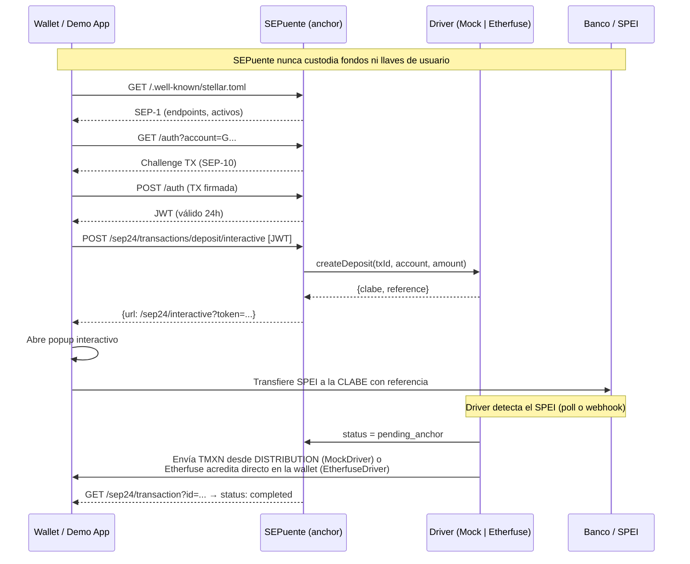

# SEPuente

> Gateway **open source y no custodial** que presenta las rampas de pesos mexicanos como un anchor estándar de Stellar, para que cualquier wallet compatible con SEP-24 pueda ofrecer depósito y retiro de pesos por SPEI sin integrar APIs propietarias.

**El producto es la capa de estándares. La app de demo es solo un cliente más.**

---

## Flujo (Mermaid)



---

## Diferenciación

| Proyecto | Qué hace | Por qué no es SEPuente |
|---|---|---|
| **Ramp Kit** | SDK que cada app integra directamente | No expone servidor SEP-24; cada app implementa la capa |
| **StellarMesh** | Mismo patrón SEP-24 pero para saldos de exchanges | No conecta rampas SPEI/fiat |
| **Anchor Platform / Anchor in a Box (SDF)** | Para convertirse en anchor propio desde cero | Requiere infraestructura propia y KYC propio |
| **SEPuente ✓** | Adaptador ligero para rampas ya reguladas sin cambiarlas | No custodial: el KYC y el dinero se quedan en el proveedor |

---

## Probar en 2 minutos

```bash
# 1. Clonar e instalar
git clone https://github.com/ALFA117/sepuente
cd sepuente
npm install

# 2. Configurar entorno
cp .env.example .env.local
# Edita .env.local con tus claves de Supabase y JWT_SECRET

# 3. Generar cuentas testnet (imprime variables para .env.local)
npm run setup-testnet

# 4. Crear tablas en Supabase
# Pega el contenido de supabase/migrations/001_initial.sql en el SQL editor

# 5. Levantar en local
npm run dev
# Abre http://localhost:3000

# 6. Probar con Demo Wallet SDF
# https://demo-wallet.stellar.org/?home_domain=localhost:3000
```

### Con anchor-tests

```bash
npx -p @stellar/anchor-tests stellar-anchor-tests \
  --home-domain sepuente.vercel.app \
  --seps 1 10 24 38
```

---

## Arquitectura

- **Framework**: Next.js 15 App Router + TypeScript, desplegable en Vercel Hobby
- **Persistencia**: Supabase (tier gratuito) con RLS habilitado
- **Stellar**: Horizon testnet + Friendbot
- **Estado**: todo en Supabase; pull-on-read (sin procesos en background)
- **Secretos**: exclusivamente en rutas de servidor (SIGNING_SECRET_KEY, ISSUER_SECRET_KEY, DISTRIBUTION_SECRET_KEY, JWT_SECRET, SUPABASE_SERVICE_ROLE_KEY)
- **CORS**: `Access-Control-Allow-Origin: *` en todos los endpoints SEP

### Drivers

| Driver | Activar | Uso |
|---|---|---|
| `MockDriver` | `DRIVER=mock` (default) | Testnet puro; "Simular SPEI" envía TMXN real |
| `EtherfuseDriver` | `DRIVER=etherfuse` | Sandbox de Etherfuse; SPEI → CETES tokenizados |

---

## SEPs implementados

| SEP | Endpoint(s) |
|---|---|
| SEP-1 | `GET /.well-known/stellar.toml` |
| SEP-10 | `GET /auth`, `POST /auth` |
| SEP-24 | `GET /sep24/info`, `POST /sep24/transactions/{deposit,withdraw}/interactive`, `GET /sep24/transaction`, `GET /sep24/transactions` + UI `/sep24/interactive` |
| SEP-38 | `GET /sep38/info`, `GET /sep38/prices`, `GET /sep38/price`, `POST /sep38/quote`, `GET /sep38/quote/:id` |

---

## Código y herramientas reutilizados

- **[@stellar/stellar-sdk](https://github.com/stellar/js-stellar-sdk)** — Challenge SEP-10, builders de transacciones, cliente Horizon
- **[Etherfuse](https://etherfuse.com)** — API de rampa MXN/CETES (EtherfuseDriver)
- **[Supabase JS](https://supabase.com)** — Persistencia serverless con RLS
- **[jose](https://github.com/panva/jose)** — Firma y verificación JWT (SEP-10)
- **[anchor-tests (SDF)](https://github.com/stellar/stellar-anchor-tests)** — Suite oficial de pruebas para anchors Stellar
- **[Demo Wallet (SDF)](https://demo-wallet.stellar.org)** — Cliente de prueba para flujos SEP-24
- **Claude (Anthropic)** — Asistente de IA usado para scaffolding y generación de código

---

## Variables de entorno

| Variable | Descripción |
|---|---|
| `SIGNING_PUBLIC_KEY` / `SIGNING_SECRET_KEY` | Cuenta para challenge SEP-10 (sin fondos necesarios) |
| `ISSUER_PUBLIC_KEY` / `ISSUER_SECRET_KEY` | Emisor del activo TMXN |
| `DISTRIBUTION_PUBLIC_KEY` / `DISTRIBUTION_SECRET_KEY` | Distribuidor; paga TMXN a usuarios en depósito (MockDriver) |
| `ASSET_CODE` | Código del activo (default: `TMXN`) |
| `JWT_SECRET` | Secreto para firmar tokens SEP-10 |
| `JWT_EXPIRY` | Duración del JWT en segundos (default: 86400) |
| `NEXT_PUBLIC_SUPABASE_URL` | URL del proyecto Supabase |
| `NEXT_PUBLIC_SUPABASE_ANON_KEY` | Anon key pública |
| `SUPABASE_SERVICE_ROLE_KEY` | Service role (solo servidor) |
| `DRIVER` | `mock` o `etherfuse` |
| `ETHERFUSE_API_KEY` | Solo si `DRIVER=etherfuse` |
| `NEXT_PUBLIC_APP_URL` | URL del deploy (sin trailing slash, siempre HTTPS) |
| `NEXT_PUBLIC_ENABLE_POLLAR` | `false` por defecto; `true` activa patrocinio de fees |

---

## Roadmap

### Q1 2027
- KYC por usuario (vinculación de cuenta Stellar con identidad verificada)
- SEP-6 (depósito/retiro sin UI interactiva)
- Webhooks firmados para notificaciones de estado
- Auditoría de seguridad independiente
- Segunda rampa (Bitso, Kushki u otro proveedor MXN regulado)

### Q2 2027
- Piloto en mainnet con volumen real
- Ruteo entre rampas con SEP-38 (mejor precio automático)
- Soporte de smart wallets (SEP-45)

---

## Licencia

MIT — úsalo, forkéalo, mejóralo. Pull requests bienvenidos.
