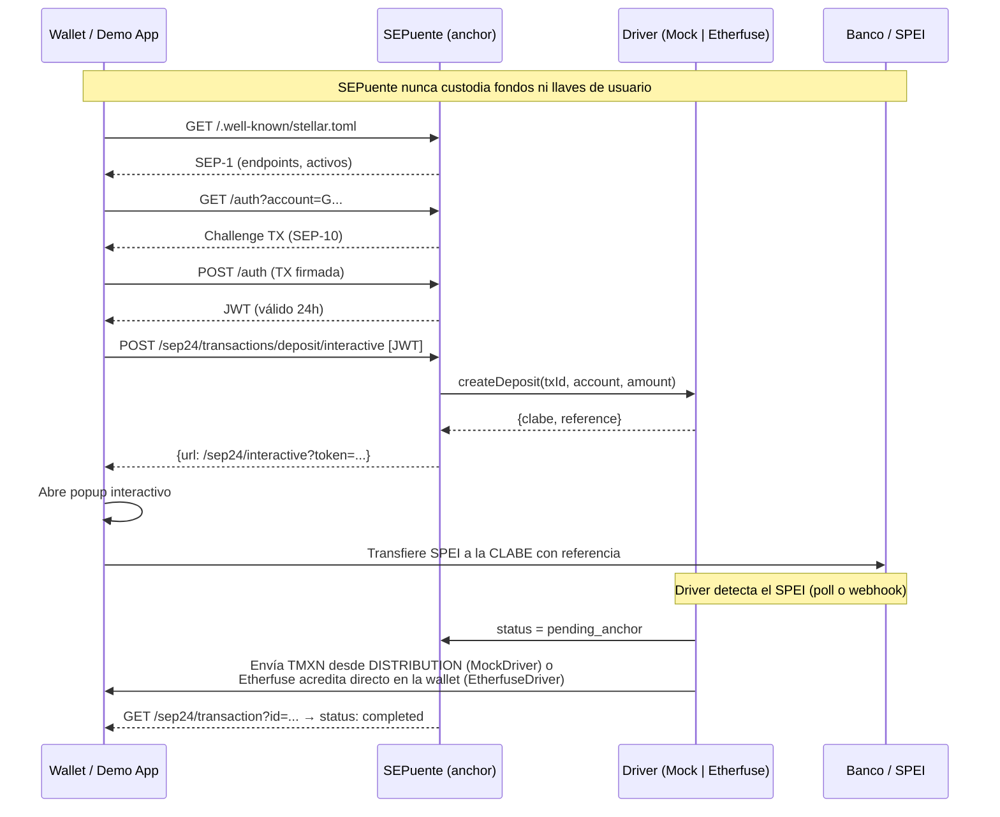

# SEPuente

> Gateway **open source y no custodial** que presenta las rampas de pesos mexicanos como un anchor estándar de Stellar, para que cualquier wallet compatible con SEP-24 pueda ofrecer depósito y retiro de pesos por SPEI sin integrar APIs propietarias.

---

## FIX_NOTES

*(generado por auditoría automática — 2026-09-26)*

### Inventario de flujos

| Flujo | Endpoint | Estado | Notas |
|---|---|---|---|
| SEP-1 | `GET /.well-known/stellar.toml` | ✅ | TOML real, CORS abierto, tokens de env vars |
| SEP-10 GET | `GET /auth?account=G...` | ✅ | `buildChallengeTx` real con SIGNING_SECRET_KEY |
| SEP-10 POST | `POST /auth` | ✅ | `verifyChallengeTxSigners` → JWT firmado con JWT_SECRET |
| SEP-24 info | `GET /sep24/info` | ✅ | Activos y fees hardcodeados por diseño |
| SEP-24 deposit | `POST /sep24/transactions/deposit/interactive` | ✅ | Crea fila en Supabase, devuelve URL interactiva con session token |
| SEP-24 withdraw | `POST /sep24/transactions/withdraw/interactive` | ✅ | Ídem, kind=withdrawal |
| SEP-24 transaction | `GET /sep24/transaction?id=` | ✅ | Pull-on-read actualiza estado via driver |
| SEP-24 transactions | `GET /sep24/transactions` | ✅ | Historial paginado, filtrado por cuenta JWT |
| SEP-38 info | `GET /sep38/info` | ✅ | Par iso4217:MXN ↔ stellar:TMXN |
| SEP-38 prices | `GET /sep38/prices` | ✅ | Delega a driver.quote |
| SEP-38 price | `GET /sep38/price` | ✅ | Cotización individual |
| SEP-38 quote POST | `POST /sep38/quote` | ✅ | Persiste en sep38_quotes, devuelve id |
| SEP-38 quote GET | `GET /sep38/quote/:id` | ✅ | Verifica expiración |
| API interna | `POST /api/sep24` | ✅ | Acciones: quote, start_deposit, start_withdraw, simulate, status |
| Faucet | `POST /api/faucet` | ✅ | Friendbot + rate limit 3/día por cuenta |
| UI interactiva | `/sep24/interactive` | ✅ | 4 pasos (form→quote→instrucciones→done), polling de estado |
| Demo | `/demo` | ✅ | Wallet demo con faucet, trustline, SEP-10 y SEP-24 integrados |

### Mocks activos (DRIVER=mock)

| Mock | Detalle | Por qué es aceptable |
|---|---|---|
| MockDriver CLABE | `646180157000000004` (ficticia) | Testnet; EtherfuseDriver devuelve CLABE real |
| MockDriver precio | Siempre 1:1 + 0.5% fee | Suficiente para demos |
| MockDriver SPEI | `simulateFiatReceived` envía TMXN real on-chain | Flujo real en testnet |

### Bugs corregidos

| Bug | Archivo | Fix |
|---|---|---|
| `findIncomingPayment` aceptaba pagos sin memo (`memo_type=none`) — falsos positivos en retiros | `lib/stellar.ts` | Eliminada la condición `\|\| txData.memo_type === "none"` — solo match exacto de memo |
| `NEXT_PUBLIC_ASSET_CODE` y `NEXT_PUBLIC_ISSUER_PUBLIC_KEY` faltaban en `.env.example` | `.env.example` | Añadidas con comentario explicativo |
| Dead code en `MockDriver.simulateFiatReceived` (rama `claimable_balance_id` idéntica en if/else) | `lib/drivers/mock.ts` | Rama colapsada a una sola llamada |
| Token `--success` inconsistente (`#4CAF82` vs `#4CD68E`) | `app/globals.css` | Unificado a `#4CD68E` |
| Tokens `--blue` y `--s2` faltaban en globals.css (usados en interactive/page.tsx) | `app/globals.css` | Añadidos |
| Campo `context` faltaba en interfaz TypeScript `Sep38Quote` | `lib/supabase.ts` | Añadido como `context?: string` |
| Import sin uso `import styles from "./landing.module.css"` en not-found.tsx | `app/not-found.tsx` | Eliminado |

### Pendientes

- EtherfuseDriver: sandbox requiere `ETHERFUSE_API_KEY` real para test de integración completo
- SEP-10 anchor-tests requiere deploy activo con env vars correctas
- No hay tests unitarios; la única cobertura es `anchor-tests` de SDF

### Verificación rápida (2 min antes del demo)

```bash
# 1. stellar.toml responde con los campos correctos
curl https://sepuente.vercel.app/.well-known/stellar.toml | head -20

# 2. Challenge SEP-10 se genera con una clave válida
curl "https://sepuente.vercel.app/auth?account=GAIEGXXX"

# 3. Demo Wallet SDF apunta al anchor
# → https://demo-wallet.stellar.org/?home_domain=sepuente.vercel.app

# 4. Tabla sep24_transactions tiene filas nuevas tras un depósito
# → Supabase Dashboard → Table editor → sep24_transactions
```

---

## DESIGN_NOTES

### Sistema de tokens CSS (`app/globals.css`)

| Token | Valor | Notas |
|---|---|---|
| `--navy` | `#0A1A33` | Fondo principal |
| `--surface` | `#11284D` | Superficies/cards |
| `--surface2` / `--s2` | `#162F59` | Superficies elevadas (alias añadido) |
| `--gold` | `#C9A227` | Acento primario, CTAs |
| `--gold-hover` | `#E0C35A` | Hover del acento |
| `--gold-disabled` | `rgba(201,162,39,0.35)` | Botón gold deshabilitado |
| `--cream` | `#F5F1E6` | Texto principal |
| `--text` | `#E8E2D5` | Texto cuerpo |
| `--muted` | `#8B9BB5` | Texto secundario, placeholders |
| `--error` | `#E05252` | Estados de error |
| `--success` | `#4CD68E` | Estados de éxito (unificado) |
| `--blue` | `#7DBAFF` | Info / Stellar accent |
| `--warning` | `#F0A500` | Avisos |
| `--border` | `rgba(139,155,181,0.18)` | Bordes de cards |
| `--border-gold` | `rgba(201,162,39,0.25)` | Borde hover gold |
| `--shadow-sm` | `0 2px 8px rgba(0,0,0,0.25)` | Sombra pequeña |
| `--shadow-md` | `0 4px 24px rgba(0,0,0,0.35)` | Sombra media |
| `--shadow-gold` | `0 4px 24px rgba(201,162,39,0.15)` | Sombra accent |
| `--radius-sm/md/lg/xl` | `8/12/16/20px` | Escala de border-radius |
| `--transition-fast/base/slow` | `150/250/400ms ease-out` | Escala de transición |

### Decisiones de diseño

- La UI interactiva (`/sep24/interactive`) usa CSS inline — intencional; se abre en popup y debe ser autocontenida.
- El pitch (`/pitch`) es self-contained en React con su propio CSS inlined — no comparte el sistema de tokens del layout principal por diseño.
- La landing, demo y devs usan sus propios módulos CSS que consumen las variables `:root`.
- Fuentes: Syne 800 (headings), Inter (body), JetBrains Mono (mono) — cargadas via `next/font` en layout.tsx.
- Keyframes globales en globals.css: `enterUp`, `fadeIn`, `pulse`, `shimmer`, `spin`.
- Utility classes globales: `.animate-in`, `.skeleton`, `.spin`, `.btn`, `.card`, `.sr-only`, `.font-mono`, `.truncate-middle`.

### Skills utilizadas

- **ui-ux-pro-max**: Enterprise Gateway / Exaggerated Minimalism — trust signals prominentes, minimal noise, NO emojis como íconos
- **motion**: implementado como CSS puro (framer-motion no instalado en el proyecto)

### Pendientes visuales

- La demo wallet (`/demo`) no tiene estado de error visual si Horizon no responde — aceptable para testnet demo.
- La página `/devs` usa estilos inline — funcional, no reutilizable; candidato a CSS module en iteración futura.

---

**El producto es la capa de estándares. La app de demo es solo un cliente más.**

---

## Flujo (Mermaid)



---

## Diferenciación

| Proyecto | Qué hace | Por qué no es SEPuente |
|---|---|---|
| **Ramp Kit** | SDK que cada app integra directamente | No expone servidor SEP-24; cada app implementa la capa |
| **StellarMesh** | Mismo patrón SEP-24 pero para saldos de exchanges | No conecta rampas SPEI/fiat |
| **Anchor Platform / Anchor in a Box (SDF)** | Para convertirse en anchor propio desde cero | Requiere infraestructura propia y KYC propio |
| **SEPuente ✓** | Adaptador ligero para rampas ya reguladas sin cambiarlas | No custodial: el KYC y el dinero se quedan en el proveedor |

---

## Probar en 2 minutos

```bash
# 1. Clonar e instalar
git clone https://github.com/ALFA117/sepuente
cd sepuente
npm install

# 2. Configurar entorno
cp .env.example .env.local
# Edita .env.local con tus claves de Supabase y JWT_SECRET

# 3. Generar cuentas testnet (imprime variables para .env.local)
npm run setup-testnet

# 4. Crear tablas en Supabase
# Pega el contenido de supabase/migrations/001_initial.sql en el SQL editor

# 5. Levantar en local
npm run dev
# Abre http://localhost:3000

# 6. Probar con Demo Wallet SDF
# https://demo-wallet.stellar.org/?home_domain=localhost:3000
```

### Con anchor-tests

```bash
npx -p @stellar/anchor-tests stellar-anchor-tests \
  --home-domain sepuente.vercel.app \
  --seps 1 10 24 38
```

---

## Arquitectura

- **Framework**: Next.js 15 App Router + TypeScript, desplegable en Vercel Hobby
- **Persistencia**: Supabase (tier gratuito) con RLS habilitado
- **Stellar**: Horizon testnet + Friendbot
- **Estado**: todo en Supabase; pull-on-read (sin procesos en background)
- **Secretos**: exclusivamente en rutas de servidor (SIGNING_SECRET_KEY, ISSUER_SECRET_KEY, DISTRIBUTION_SECRET_KEY, JWT_SECRET, SUPABASE_SERVICE_ROLE_KEY)
- **CORS**: `Access-Control-Allow-Origin: *` en todos los endpoints SEP

### Drivers

| Driver | Activar | Uso |
|---|---|---|
| `MockDriver` | `DRIVER=mock` (default) | Testnet puro; "Simular SPEI" envía TMXN real |
| `EtherfuseDriver` | `DRIVER=etherfuse` | Sandbox de Etherfuse; SPEI → CETES tokenizados |

---

## SEPs implementados

| SEP | Endpoint(s) |
|---|---|
| SEP-1 | `GET /.well-known/stellar.toml` |
| SEP-10 | `GET /auth`, `POST /auth` |
| SEP-24 | `GET /sep24/info`, `POST /sep24/transactions/{deposit,withdraw}/interactive`, `GET /sep24/transaction`, `GET /sep24/transactions` + UI `/sep24/interactive` |
| SEP-38 | `GET /sep38/info`, `GET /sep38/prices`, `GET /sep38/price`, `POST /sep38/quote`, `GET /sep38/quote/:id` |

---

## Código y herramientas reutilizados

- **[@stellar/stellar-sdk](https://github.com/stellar/js-stellar-sdk)** — Challenge SEP-10, builders de transacciones, cliente Horizon
- **[Etherfuse](https://etherfuse.com)** — API de rampa MXN/CETES (EtherfuseDriver)
- **[Supabase JS](https://supabase.com)** — Persistencia serverless con RLS
- **[jose](https://github.com/panva/jose)** — Firma y verificación JWT (SEP-10)
- **[anchor-tests (SDF)](https://github.com/stellar/stellar-anchor-tests)** — Suite oficial de pruebas para anchors Stellar
- **[Demo Wallet (SDF)](https://demo-wallet.stellar.org)** — Cliente de prueba para flujos SEP-24
- **Claude (Anthropic)** — Asistente de IA usado para scaffolding y generación de código

---

## Variables de entorno

| Variable | Descripción |
|---|---|
| `SIGNING_PUBLIC_KEY` / `SIGNING_SECRET_KEY` | Cuenta para challenge SEP-10 (sin fondos necesarios) |
| `ISSUER_PUBLIC_KEY` / `ISSUER_SECRET_KEY` | Emisor del activo TMXN |
| `DISTRIBUTION_PUBLIC_KEY` / `DISTRIBUTION_SECRET_KEY` | Distribuidor; paga TMXN a usuarios en depósito (MockDriver) |
| `ASSET_CODE` | Código del activo (default: `TMXN`) |
| `JWT_SECRET` | Secreto para firmar tokens SEP-10 |
| `JWT_EXPIRY` | Duración del JWT en segundos (default: 86400) |
| `NEXT_PUBLIC_SUPABASE_URL` | URL del proyecto Supabase |
| `NEXT_PUBLIC_SUPABASE_ANON_KEY` | Anon key pública |
| `SUPABASE_SERVICE_ROLE_KEY` | Service role (solo servidor) |
| `DRIVER` | `mock` o `etherfuse` |
| `ETHERFUSE_API_KEY` | Solo si `DRIVER=etherfuse` |
| `NEXT_PUBLIC_APP_URL` | URL del deploy (sin trailing slash, siempre HTTPS) |
| `NEXT_PUBLIC_ENABLE_POLLAR` | `false` por defecto; `true` activa patrocinio de fees |

---

## Roadmap

### Q1 2027
- KYC por usuario (vinculación de cuenta Stellar con identidad verificada)
- SEP-6 (depósito/retiro sin UI interactiva)
- Webhooks firmados para notificaciones de estado
- Auditoría de seguridad independiente
- Segunda rampa (Bitso, Kushki u otro proveedor MXN regulado)

### Q2 2027
- Piloto en mainnet con volumen real
- Ruteo entre rampas con SEP-38 (mejor precio automático)
- Soporte de smart wallets (SEP-45)

---

## Licencia

MIT — úsalo, forkéalo, mejóralo. Pull requests bienvenidos.
