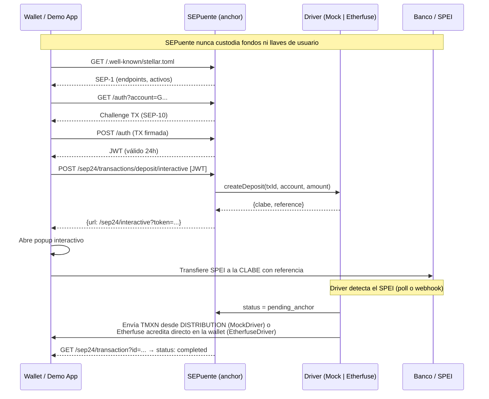

# SEPuente

> Gateway **open source y no custodial** que presenta las rampas de pesos mexicanos como un anchor estándar de Stellar, para que cualquier wallet compatible con SEP-24 pueda ofrecer depósito y retiro de pesos por SPEI sin integrar APIs propietarias.

---

## FIX_NOTES

*Auditoría y reparación con foco móvil — 2026-09-26. Evaluado en viewport de 380 px contra producción (`sepuente.vercel.app`, Stellar testnet).*

### Inventario: estado encontrado → estado actual

| Pantalla / flujo | Antes | Ahora |
|---|---|---|
| Landing `/` | Funciona; en móvil los números del hero tocaban los bordes, título con degradado y glifo tipo logo, diagrama SVG ilegible (texto de ~5 px) | ✅ Rediseñada mobile-first, diagrama en HTML que se apila |
| Wallet demo `/demo` — faucet | A medias: decía "fondeada" aunque Friendbot fallara | ✅ Verifica que la cuenta exista; error claro si Friendbot no responde |
| Demo — trustline | Funciona | ✅ Errores de Horizon traducidos a mensajes humanos |
| Demo — SEP-10 | Funciona, pero la sesión se perdía al recargar | ✅ JWT en sessionStorage con verificación de expiración; "Cerrar sesión" |
| Demo — abrir depósito/retiro | **Roto en móvil**: `window.open` se llamaba después de un `fetch`, y Safari/Chrome móvil lo bloquean | ✅ La ventana se abre dentro del gesto; si el navegador la bloquea, navega en la misma pestaña |
| Demo — historial | A medias: no se actualizaba solo; montos con la moneda equivocada; sin estado de error | ✅ Sondeo cada 6 s mientras haya operaciones pendientes, refresco al volver a la pestaña, esqueleto, vacío y error con "Reintentar" |
| Depósito SEP-24 — "Simular SPEI" | **Roto en producción**: Horizon devolvía `tx_bad_auth`, la ruta relanzaba la excepción y Next respondía 500 con cuerpo vacío → *"Unexpected end of JSON input"* | ✅ Envía TMXN real en testnet, verificable en stellar.expert |
| Retiro SEP-24 | **Roto**: nadie enviaba los TMXN al anchor (la wallet demo no tenía ese paso) y el sondeo del popup solo leía la BD, nunca consultaba Horizon | ✅ Botón "Enviar TMXN al anchor" en el historial (firma la wallet, no el anchor); el sondeo detecta el pago en Horizon y completa |
| SPEI simulado | Simulado **sin avisar** en varios textos ("El pago SPEI fue procesado. Revisa tu cuenta bancaria") | ✅ Marcado como *Modo prueba* en toda la UI (flag `sandbox` que devuelve el servidor cuando `DRIVER=mock`) |
| `/devs` | Funciona; tarjeta "Demo interactivo" apuntaba a `/`; afirmaba "todos los tests pasan" y "cotización firmada / precios en tiempo real" (el mock usa precio fijo) | ✅ Enlaces y textos corregidos; tablas anchas → listas legibles |
| `/pitch` | Funciona y ya era responsivo | ✅ Colores y tipografía migrados a tokens; verificado sin desbordes en las 9 diapositivas |
| 404 | Funciona | ✅ Rediseñada con encabezado/pie compartidos |
| SEP-1 / SEP-10 / SEP-38 | Funcionan | ✅ Sin cambios de comportamiento; validación de cuentas con `StrKey` |

### Bugs corregidos (en orden de criticidad)

| # | Bug | Causa | Arreglo | Archivos |
|---|---|---|---|---|
| 1 | "Simular SPEI" → *Unexpected end of JSON input* | Variables de entorno de Vercel con espacios/saltos de línea (p. ej. `DRIVER` no era `"mock"` exacto y la firma de distribución fallaba con `tx_bad_auth`) + excepción relanzada dentro de la ruta | `lib/env.ts` recorta todas las variables; la ruta siempre responde JSON; `lib/errors.ts` traduce códigos de Horizon; chequeo explícito de que `DISTRIBUTION_SECRET_KEY` corresponda a `DISTRIBUTION_PUBLIC_KEY` | `lib/env.ts`, `app/api/sep24/route.ts`, `lib/errors.ts`, `lib/stellar.ts` |
| 2 | Retiro nunca se completaba | Faltaba el pago de la wallet y el sondeo no llamaba a `driver.getStatus` | Paso de pago en la demo + `status` consulta al driver en estados pendientes + `/sep24/transaction` expone `withdraw_anchor_account`, `withdraw_memo`, `withdraw_memo_type` (spec SEP-24) | `app/demo/page.tsx`, `app/api/sep24/route.ts`, `app/sep24/transaction/route.ts` |
| 3 | Doble clic en "Simular" podía enviar TMXN dos veces | Sin idempotencia | Reclamo atómico `pending_user_transfer_start → pending_stellar` con `UPDATE … WHERE status=…`; si Stellar falla, se revierte | `lib/drivers/mock.ts` |
| 4 | Reintentar "Confirmar" creaba instrucciones nuevas | Sin idempotencia | `start_deposit`/`start_withdraw` devuelven las mismas instrucciones si ya existen; 409 si ya se procesó | `app/api/sep24/route.ts` |
| 5 | Inserts de Supabase fallaban en silencio | No se revisaba `error` | 500 con mensaje claro y log de servidor | `app/sep24/transactions/*/interactive/route.ts` |
| 6 | Montos sin validar en servidor | — | `lib/amount.ts` (10–50 000, máx. 2 decimales) en cliente y servidor; `asset_code` validado; URL interactiva con `encodeURIComponent` | `lib/amount.ts`, rutas interactivas |
| 7 | Retiro aceptaba cualquier pago con el memo | No se comparaba el monto | Se exige monto ≥ al solicitado; se registran `amount_fee` y `amount_out` | `lib/drivers/mock.ts` |
| 8 | `JWT_SECRET` con valor por defecto si faltaba | Fallback inseguro | En producción falla si no está configurado | `lib/jwt.ts` |
| 9 | Popup bloqueado en móvil | `window.open` fuera del gesto | Ver inventario | `app/demo/page.tsx` |
| 10 | "Volver a la wallet" cerraba la pestaña aunque no fuera popup | `window.close()` incondicional | Solo cierra si existe `window.opener`; si no, navega a `/demo` | `app/sep24/interactive/page.tsx` |
| 11 | Recargar la pantalla interactiva reiniciaba el flujo | Sin restauración | Al montar consulta `status` y retoma instrucciones o resultado | `app/sep24/interactive/page.tsx` |
| 12 | Intervalos de sondeo que nunca se limpiaban | `setInterval` sin cleanup | Sondeo en `useEffect` con limpieza y aviso tras 3 fallos seguidos | `app/sep24/interactive/page.tsx` |
| 13 | Contenido invisible si el scroll-reveal no se disparaba | Dependía solo de IntersectionObserver | Lo visible al cargar no se oculta; respaldo por scroll y a los 4 s | `app/components/ScrollReveal.tsx` |

### Seguridad

- Ningún secreto llega al navegador: solo se leen `NEXT_PUBLIC_*` en componentes cliente (verificado con búsqueda de `process.env` en archivos `"use client"`).
- La llave privada de la wallet demo vive en `sessionStorage` del usuario; SEPuente nunca la recibe (la wallet firma trustline, SEP-10 y el pago del retiro).
- CORS abierto en todos los endpoints SEP (sin cambios). `/api/sep24` y `/api/faucet` son internos.
- Validación de direcciones con `StrKey.isValidEd25519PublicKey`, montos con `lib/amount.ts`, CLABE con dígito verificador en cliente y servidor.

### Cómo verificarlo

`node scripts/e2e-testnet.mjs https://sepuente.vercel.app` recorre faucet → trustline → SEP-10 → depósito (con doble "simular" para probar idempotencia) → retiro con pago real → historial. Última corrida: **E2E OK** (depósito `1d7b2389…f839d`, retiro `8f20367c…6b1f8` en stellar.expert/testnet).

### Pendientes

- Supabase de producción no está accesible desde este entorno; el esquema se asumió igual a `supabase/migrations/001_initial.sql`.
- `EtherfuseDriver` no se probó (requiere `ETHERFUSE_API_KEY`).
- El proyecto no tiene ESLint configurado ni tests unitarios; la cobertura es el script E2E y la suite `anchor-tests` de SDF.
- `public/pitch.html` es una versión estática heredada, fuera del sistema de diseño.

### Ronda de feedback de usuario (2026-09-26)

| Observación | Qué se hizo |
|---|---|
| El proyecto asume que conoces Stellar (SEP, trustline, anchor, TMXN aparecen de inmediato) | El hero del landing explica el beneficio en lenguaje simple; nueva sección "En palabras simples" (3 pasos: banco → pesos digitales → de regreso); glosario desplegable `app/components/Glossary.tsx` en landing, demo y docs; pasos de la demo renombrados ("Obtén saldo de prueba", "Activa los pesos digitales", "Conéctate al anchor") con el término técnico como etiqueta secundaria. |
| La demo abre una segunda ventana y rompe la continuidad | El flujo SEP-24 se abre en una hoja modal dentro de la wallet (`app/demo/AnchorSheet.tsx`, iframe de la misma origin, como permite SEP-24). Anchor y wallet se comunican por `postMessage` (origen y `source` validados): la pantalla del anchor avisa cambios de estado, pide cerrar, y en el retiro muestra "Enviar X TMXN desde mi wallet", que le pide a la wallet firmar el pago con su llave, sin salir del flujo. Verificado en producción: 0 ventanas nuevas. |
| En la guía rápida aparece "THXN" en vez de "TMXN" | No existe la cadena "THXN" en el código ni en el HTML servido; el código del activo se mostraba en fuente monoespaciada pequeña, donde la "M" puede leerse como "H". Ahora se muestra con el componente `Token` (fuente de texto, negrita) y deletreado: "T-M-X-N: Test MXN". |

### Verificar en dos minutos en el celular

1. Abre `sepuente.vercel.app` en el teléfono: el título serif, la vista previa animada del depósito y el botón oro "Probar la demo" se ven completos, nada se sale por los lados.
2. Baja a "En palabras simples" y abre **¿Nuevo en Stellar?**: el glosario se despliega.
3. Toca ☰ → **Demo**. **Obtener saldo de prueba** → en ~5 s el saldo XLM muestra 10,000.00 y el paso 1 queda en verde.
4. **Activar pesos digitales** → el saldo TMXN pasa de "—" a 0.00.
5. **Conectar mi wallet** → aparece "Sesión SEP-10 activa" y se desbloquean Depositar/Retirar.
6. **Depositar** → se abre una hoja dentro de la misma página (no una ventana nueva). Escribe `250` → **Ver cotización** → **Confirmar operación**.
7. **Simular SPEI recibido** → en ~5 s ves "TMXN acreditado"; toca **Ver en stellar.expert** y confirma la transacción.
8. **Volver a la wallet** → la hoja se cierra; el historial muestra el depósito "Completado" y el saldo TMXN ≈ 248.75.
9. **Retirar** → `100`, toca **Usar CLABE de prueba** → **Ver cotización** → **Confirmar operación**.
10. Toca **Enviar 100.00 TMXN desde mi wallet** dentro de la hoja → en ~10 s ves "Retiro completado".
11. Abre `/pitch`: con el botón dorado inferior avanzas capítulo por capítulo; la barra dorada superior marca el progreso.
12. Gira el teléfono: nada se desborda. Escribe un monto de `5`: aparece "El monto mínimo es $10 MXN".

---

## DESIGN_NOTES

### Tokens (`app/globals.css`, única fuente de verdad)

Todos los componentes consumen variables CSS; no hay colores, tamaños, radios ni sombras literales fuera de `globals.css` (excepciones justificadas abajo). Las transparencias usan canales: `rgb(var(--gold-rgb) / 0.12)`.

| Grupo | Tokens |
|---|---|
| Superficies | `--bg` #0A1A33 · `--bg-deep` #061123 · `--surface` #11284D · `--surface2` #173564 · `--surface3` #1E427A · `--scrim` |
| Acento | `--gold` #C9A227 · `--gold-hover` #E0C35A · `--gold-active` #B08D1F · `--gold-disabled` · `--gold-dim` · `--on-gold` |
| Texto | `--cream` #F5F1E6 · `--text` (crema 92 %) · `--muted` #B8C2D6 · `--subtle` (secundario 72 %) |
| Semánticos | `--success` #4FB280 · `--danger` #E56660 · `--warning` #E2A848 · `--info` #8FB3E0, cada uno con `-dim` |
| Bordes | `--border` · `--border-strong` · `--border-gold` |
| Tipografía | `--font-display` Source Serif 4 · `--font-body` Inter · `--font-mono` JetBrains Mono (todas vía `next/font`) |
| Escala tipográfica | `--fs-display` · `--fs-h1` · `--fs-h2` (fluidas con `clamp`) · `--fs-h3` 20px · `--fs-body` 16px · `--fs-small` 14px · `--fs-label` 12px · `--fs-mono` 13px |
| Espaciado | `--sp-1…--sp-16` (base 4 px) · `--gutter` clamp(16px, 4vw, 32px) · `--tap` 44px |
| Radios | `--radius-sm` 8 · `--radius-md` 12 · `--radius-lg` 16 · `--radius-xl` 22 · `--radius-full` |
| Sombras | `--shadow-sm/md/lg` tintadas de marino · `--shadow-gold` · `--focus-ring` |
| Movimiento | `--ease-out` · `--transition-fast/base/slow` (150/250/400 ms) |
| Áreas seguras | `--safe-top/bottom/left/right` = `env(safe-area-inset-*)` |

Alias heredados (`--navy`, `--s2`, `--accent`, `--error`, `--blue`, `--font-syne`) apuntan a los tokens nuevos para no romper código existente.

### Decisiones

- **Sin Tailwind.** El brief pedía tokens "consumidos por Tailwind", pero el proyecto usa CSS Modules y no tiene Tailwind instalado. Migrar todo habría sido un cambio de alcance y de riesgo; se centralizaron los tokens como variables CSS consumidas por CSS Modules, que cumple el objetivo (una sola fuente de verdad). Si se agrega Tailwind, basta mapear `theme.extend.colors` a estas variables.
- **Paleta UNAM** según el brief; se reemplazó la paleta ámbar/morado de la iteración anterior. El morado se mapeó a `--info` (azul derivado del secundario #B8C2D6).
- **Serif para títulos**: Source Serif 4 (buena legibilidad en pantallas pequeñas, pesos 500–700). Inter para cuerpo. Mono para direcciones, hashes, montos y CLABE.
- **Wordmark tipográfico**: "SEPuente" en serif con "SEP" en oro. Sin escudos ni logos oficiales. Favicon: "S" serif oro sobre marino con un arco de puente sutil.
- **Componentes compartidos**: `app/components/SiteHeader.tsx` (encabezado sticky con safe-area, menú móvil accesible con Escape y clic fuera, pie) y `app/components/ui.tsx` + `ui.module.css` (botones, tarjetas, badges de estado, aviso de modo prueba, campos, copiar, estado vacío, esqueleto, toasts).
- **Móvil**: gutter mínimo de 16 px más safe-area; áreas táctiles ≥ 44 px (botones principales 48–52 px); inputs a 17 px para evitar el zoom de iOS; `inputMode` decimal/numérico; acciones del flujo SEP-24 en una barra fija inferior al alcance del pulgar (estática desde 560 px); direcciones y hashes en mono truncados en medio (`lib/format.ts`); bloques de código con su propio scroll horizontal.
- **Estados**: esqueletos en saldos e historial, spinners en botones con `aria-busy` (sin verse deshabilitados), toasts con `aria-live`, estado vacío ilustrado, errores humanos con acción de recuperación.
- **Accesibilidad**: enlace "Saltar al contenido", foco visible en oro, etiquetas en todos los campos, `aria-invalid` + mensaje junto al campo, contraste de texto ≥ 4.5:1 sobre marino, animaciones desactivadas con `prefers-reduced-motion`.
- **Movimiento (Motion)**: se agregó `motion` (v12). Primitivas en `app/components/motion.tsx` (`Reveal`, `Stagger`, `Enter`, `Pressable`, `DrawCheck`) con un solo ritmo: entradas en tween ease-out (0.45–0.55 s, escalonado de 60 ms), interacciones en spring (stiffness 400, damping 24). Todas consultan `useReducedMotion()` y muestran el estado final sin animar cuando el sistema lo pide.
- **Pitch (`/pitch`)**: reconstruido como narrativa por capítulos (patrón "scroll-triggered storytelling" de la guía de UI): en el teléfono es scroll vertical con barra de progreso y control flotante al alcance del pulgar; en escritorio agrega ajuste por capítulo, teclado (← → ↑ ↓, Espacio, Inicio/Fin) e índice lateral con indicador animado (`layoutId`).
- **Hero del landing**: `TransferPreview` ilustra el flujo real (1,000 MXN → 995 TMXN con la comisión real de 0.5 %) y está rotulado como ilustración.
- **Flujo SEP-24 dentro de la wallet**: hoja modal a pantalla completa en el teléfono (con safe-area) y panel centrado en escritorio; cierra con ✕, Escape o clic en el fondo, devuelve el foco y bloquea el scroll del fondo.

### Excepciones a "sin literales"

- `app/layout.tsx` → `themeColor` del meta necesita un valor literal.
- `app/icon.svg` y `app/opengraph-image.tsx` → se renderizan fuera del DOM (Satori no resuelve variables CSS); usan una constante que replica los tokens.

### Pendientes visuales

- `public/pitch.html` (estático) no usa el sistema.

### Dónde hay movimiento (Motion)

| Lugar | Qué anima |
|---|---|
| Encabezado | Menú móvil con resorte y ítems escalonados (sale más rápido de lo que entra); ícono ☰ ↔ ✕ con rotación; en escritorio, indicador de la página activa que se desliza (`layoutId`). |
| Avisos (toasts) | Entran con resorte desde abajo, salen en 150 ms y los restantes se reacomodan (`layout`). |
| Pantalla SEP-24 | Cada paso entra desde la derecha y sale hacia la izquierda (`AnimatePresence mode="wait"`); al completar, el círculo aparece con resorte y el check se dibuja (`pathLength`). |
| Demo | Entrada escalonada de la pantalla; el número del paso se convierte en check con resorte; saldos y estados cambian con fundido; filas nuevas del historial entran desde arriba; tarjetas de operación con escala al tocar. |
| Hoja del anchor | Sube con resorte sobre un fondo desenfocado; se cierra con salida corta. |
| Landing, pitch y docs | Entradas al cargar y apariciones al hacer scroll (escalonado 60 ms); vista previa del depósito y barra de progreso del pitch. |

Con "reducir movimiento" activado en el sistema, todo se muestra en su estado final al instante. Se verificó con Chrome emulando `prefers-reduced-motion: reduce` (0 elementos ocultos en landing, docs, pitch y demo) y con scroll completo en modo normal. Se eliminó `ScrollReveal.tsx` y sus reglas CSS.

---


**El producto es la capa de estándares. La app de demo es solo un cliente más.**

---

## Flujo (Mermaid)



---

## Diferenciación

| Proyecto | Qué hace | Por qué no es SEPuente |
|---|---|---|
| **Ramp Kit** | SDK que cada app integra directamente | No expone servidor SEP-24; cada app implementa la capa |
| **StellarMesh** | Mismo patrón SEP-24 pero para saldos de exchanges | No conecta rampas SPEI/fiat |
| **Anchor Platform / Anchor in a Box (SDF)** | Para convertirse en anchor propio desde cero | Requiere infraestructura propia y KYC propio |
| **SEPuente ✓** | Adaptador ligero para rampas ya reguladas sin cambiarlas | No custodial: el KYC y el dinero se quedan en el proveedor |

---

## Probar en 2 minutos

```bash
# 1. Clonar e instalar
git clone https://github.com/ALFA117/sepuente
cd sepuente
npm install

# 2. Configurar entorno
cp .env.example .env.local
# Edita .env.local con tus claves de Supabase y JWT_SECRET

# 3. Generar cuentas testnet (imprime variables para .env.local)
npm run setup-testnet

# 4. Crear tablas en Supabase
# Pega el contenido de supabase/migrations/001_initial.sql en el SQL editor

# 5. Levantar en local
npm run dev
# Abre http://localhost:3000

# 6. Probar con Demo Wallet SDF
# https://demo-wallet.stellar.org/?home_domain=localhost:3000
```

### Con anchor-tests

```bash
npx -p @stellar/anchor-tests stellar-anchor-tests \
  --home-domain sepuente.vercel.app \
  --seps 1 10 24 38
```

---

## Arquitectura

- **Framework**: Next.js 15 App Router + TypeScript, desplegable en Vercel Hobby
- **Persistencia**: Supabase (tier gratuito) con RLS habilitado
- **Stellar**: Horizon testnet + Friendbot
- **Estado**: todo en Supabase; pull-on-read (sin procesos en background)
- **Secretos**: exclusivamente en rutas de servidor (SIGNING_SECRET_KEY, ISSUER_SECRET_KEY, DISTRIBUTION_SECRET_KEY, JWT_SECRET, SUPABASE_SERVICE_ROLE_KEY)
- **CORS**: `Access-Control-Allow-Origin: *` en todos los endpoints SEP

### Drivers

| Driver | Activar | Uso |
|---|---|---|
| `MockDriver` | `DRIVER=mock` (default) | Testnet puro; "Simular SPEI" envía TMXN real |
| `EtherfuseDriver` | `DRIVER=etherfuse` | Sandbox de Etherfuse; SPEI → CETES tokenizados |

---

## SEPs implementados

| SEP | Endpoint(s) |
|---|---|
| SEP-1 | `GET /.well-known/stellar.toml` |
| SEP-10 | `GET /auth`, `POST /auth` |
| SEP-24 | `GET /sep24/info`, `POST /sep24/transactions/{deposit,withdraw}/interactive`, `GET /sep24/transaction`, `GET /sep24/transactions` + UI `/sep24/interactive` |
| SEP-38 | `GET /sep38/info`, `GET /sep38/prices`, `GET /sep38/price`, `POST /sep38/quote`, `GET /sep38/quote/:id` |

---

## Código y herramientas reutilizados

- **[@stellar/stellar-sdk](https://github.com/stellar/js-stellar-sdk)** — Challenge SEP-10, builders de transacciones, cliente Horizon
- **[Etherfuse](https://etherfuse.com)** — API de rampa MXN/CETES (EtherfuseDriver)
- **[Supabase JS](https://supabase.com)** — Persistencia serverless con RLS
- **[jose](https://github.com/panva/jose)** — Firma y verificación JWT (SEP-10)
- **[anchor-tests (SDF)](https://github.com/stellar/stellar-anchor-tests)** — Suite oficial de pruebas para anchors Stellar
- **[Demo Wallet (SDF)](https://demo-wallet.stellar.org)** — Cliente de prueba para flujos SEP-24
- **Claude (Anthropic)** — Asistente de IA usado para scaffolding y generación de código

---

## Variables de entorno

| Variable | Descripción |
|---|---|
| `SIGNING_PUBLIC_KEY` / `SIGNING_SECRET_KEY` | Cuenta para challenge SEP-10 (sin fondos necesarios) |
| `ISSUER_PUBLIC_KEY` / `ISSUER_SECRET_KEY` | Emisor del activo TMXN |
| `DISTRIBUTION_PUBLIC_KEY` / `DISTRIBUTION_SECRET_KEY` | Distribuidor; paga TMXN a usuarios en depósito (MockDriver) |
| `ASSET_CODE` | Código del activo (default: `TMXN`) |
| `JWT_SECRET` | Secreto para firmar tokens SEP-10 |
| `JWT_EXPIRY` | Duración del JWT en segundos (default: 86400) |
| `NEXT_PUBLIC_SUPABASE_URL` | URL del proyecto Supabase |
| `NEXT_PUBLIC_SUPABASE_ANON_KEY` | Anon key pública |
| `SUPABASE_SERVICE_ROLE_KEY` | Service role (solo servidor) |
| `DRIVER` | `mock` o `etherfuse` |
| `ETHERFUSE_API_KEY` | Solo si `DRIVER=etherfuse` |
| `NEXT_PUBLIC_APP_URL` | URL del deploy (sin trailing slash, siempre HTTPS) |
| `NEXT_PUBLIC_ENABLE_POLLAR` | `false` por defecto; `true` activa patrocinio de fees |

---

## Roadmap

### Q1 2027
- KYC por usuario (vinculación de cuenta Stellar con identidad verificada)
- SEP-6 (depósito/retiro sin UI interactiva)
- Webhooks firmados para notificaciones de estado
- Auditoría de seguridad independiente
- Segunda rampa (Bitso, Kushki u otro proveedor MXN regulado)

### Q2 2027
- Piloto en mainnet con volumen real
- Ruteo entre rampas con SEP-38 (mejor precio automático)
- Soporte de smart wallets (SEP-45)

---

## Licencia

MIT — úsalo, forkéalo, mejóralo. Pull requests bienvenidos.
