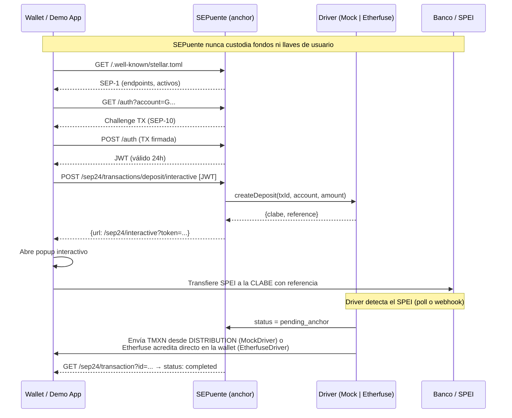

# SEPuente

> La primera capa open source que convierte transferencias SPEI en una rampa estándar SEP-24 para Stellar.

Cualquier wallet compatible con Stellar puede ofrecer depósitos y retiros en pesos mexicanos sin integrar APIs bancarias propietarias ni custodiar fondos de los usuarios.

## GOYA HACK · CriptoUNAM 2026

| | |
|---|---|
| **Track** | Blockchain |
| **Sponsors** | Stellar · BAF · Pollar (login por correo, trustline, firma SEP-10 y pago del retiro en la demo) |
| **Demo en vivo** | https://sepuente.vercel.app (wallet de prueba en `/demo`, pitch en `/pitch`, docs en `/devs`) |
| **Repositorio** | https://github.com/ALFA117/sepuente |
| **Red** | Stellar Testnet · activo `TMXN` (1 TMXN = 1 peso de prueba) |
| **Equipo** | [ALFA117](https://github.com/ALFA117) |

**En una frase:** mandas pesos desde tu banco por SPEI y los recibes como pesos digitales en cualquier wallet de Stellar (y de regreso), sin que SEPuente custodie tu dinero ni tus llaves.

**Qué funciona hoy, verificable:**
- Flujo completo de depósito y retiro en testnet, con transacciones reales visibles en stellar.expert (`node scripts/e2e-testnet.mjs https://sepuente.vercel.app`).
- **75 de 76 pruebas oficiales de SDF (`@stellar/anchor-tests`) en SEP-1, 10, 24 y 38** contra producción (27 sep 2026). La única restante mide la hora del reto SEP-10 contra el reloj de la computadora que corre la prueba; ver [Validación con anchor-tests](#validación-con-anchor-tests).
- SPEI simulado y marcado como "Modo prueba" en toda la interfaz (`DRIVER=mock`); el driver de Etherfuse está escrito pero no probado sin API key.

### Para jueces: los 4 criterios en un minuto

**1 · Ejecución técnica: corre en Stellar testnet.** Abre cualquiera de estos enlaces:

| Qué | En stellar.expert |
|---|---|
| Depósito: el anchor paga 248.75 TMXN a una wallet | [`53cb393e…8ded5db`](https://stellar.expert/explorer/testnet/tx/53cb393ef250d27119a5a5ed6caef0e41be889a45f2d1edb81b3c361e8ded5db) |
| Retiro: la wallet paga 100 TMXN al anchor con memo | [`555c38ce…91aac3b6`](https://stellar.expert/explorer/testnet/tx/555c38ce6eae6238300c7d8806e28339961c741c6a3e89714ee07dbe91aac3b6) |
| Emisor del activo TMXN | [`GAIEJKMT…FX63UG`](https://stellar.expert/explorer/testnet/account/GAIEJKMT4RMRLTZ22KI7TMANXETIWO4T2H5RZG3MZDJKXDDLM4FX63UG) |
| Cuenta de distribución del anchor | [`GC2UNTIN…IS3MGE2`](https://stellar.expert/explorer/testnet/account/GC2UNTINTDLHZE6UYO5JPTT5DAJ3Y6GYF7TPE2V5KCO2BJFX3IS3MGE2) |
| Descubrimiento SEP-1 | [`/.well-known/stellar.toml`](https://sepuente.vercel.app/.well-known/stellar.toml) |

Son de la corrida completa contra producción del 27 sep 2026. Para generar las tuyas: abre [`/demo`](https://sepuente.vercel.app/demo), completa los 3 pasos y haz un depósito; el historial enlaza cada pago a stellar.expert. La suite oficial de SDF da 75/76 ([detalle](#validación-con-anchor-tests)).

**2 · Ajuste producto-problema: por qué Stellar.**
- **Usuario:** una wallet o app de Stellar que quiere ofrecer pesos mexicanos (remesas, pagos a freelancers). **Tarea:** agregar depósito y retiro por SPEI sin integrar la API de cada banco ni custodiar fondos.
- **Por qué Stellar:** anchors y SEP-24 son el estándar de rampas de Stellar; una wallet integra una vez y funciona con cualquier anchor, y SEPuente se descubre solo con `stellar.toml`. Emitir el peso (TMXN) es nativo, con trustline, sin contrato ni puente. La liquidación tarda unos 5 s y cuesta 0.00001 XLM, viable para montos chicos. En otra cadena no existe un estándar equivalente de rampas fiat.

**3 · Impacto: quién se beneficia.**
- La persona en México que recibe dinero en su wallet y necesita pesos en su CLABE (México recibió más de 60 mil millones de dólares en remesas en 2023, según Banxico).
- Las wallets del ecosistema Stellar, que obtienen una rampa MXN abierta (MIT) sin depender de un proveedor.
- La comunidad UNAM: el código es MIT y un `RampDriver` nuevo basta para conectar otro proveedor SPEI.
- **Resultado visible en la demo:** un depósito que termina en un pago TMXN real en testnet y un retiro que la wallet firma y el anchor detecta en la red.

**4 · Demostración y claridad.**
- Video (≤ 3 min): guion en [`VIDEO.md`](VIDEO.md).
- Repositorio público, licencia MIT.
- Reproducir en 2 minutos: abre `/demo` en el teléfono, sin instalar nada. Para correrlo local: `npm install`, copia `.env.example` a `.env.local` y ejecuta `npm run dev` (ver [Probar en 2 minutos](#probar-en-2-minutos)).
- Código reutilizado y asistentes de IA declarados en [Código y herramientas reutilizados](#código-y-herramientas-reutilizados). Todo el trabajo propio se hizo durante el hackathon (primer commit: 25 sep 2026).

---

## FIX_NOTES

*Auditoría y reparación con foco móvil — 2026-09-26. Evaluado en viewport de 380 px contra producción (`sepuente.vercel.app`, Stellar testnet).*

### Inventario: estado encontrado → estado actual

| Pantalla / flujo | Antes | Ahora |
|---|---|---|
| Landing `/` | Funciona; en móvil los números del hero tocaban los bordes, título con degradado y glifo tipo logo, diagrama SVG ilegible (texto de ~5 px) | ✅ Rediseñada mobile-first, diagrama en HTML que se apila |
| Wallet demo `/demo` — faucet | A medias: decía "fondeada" aunque Friendbot fallara | ✅ Verifica que la cuenta exista; error claro si Friendbot no responde |
| Demo — trustline | Funciona | ✅ Errores de Horizon traducidos a mensajes humanos |
| Demo — SEP-10 | Funciona, pero la sesión se perdía al recargar | ✅ JWT en sessionStorage con verificación de expiración; "Cerrar sesión" |
| Demo — abrir depósito/retiro | **Roto en móvil**: `window.open` se llamaba después de un `fetch`, y Safari/Chrome móvil lo bloquean | ✅ La ventana se abre dentro del gesto; si el navegador la bloquea, navega en la misma pestaña |
| Demo — historial | A medias: no se actualizaba solo; montos con la moneda equivocada; sin estado de error | ✅ Sondeo cada 6 s mientras haya operaciones pendientes, refresco al volver a la pestaña, esqueleto, vacío y error con "Reintentar" |
| Depósito SEP-24 — "Simular SPEI" | **Roto en producción**: Horizon devolvía `tx_bad_auth`, la ruta relanzaba la excepción y Next respondía 500 con cuerpo vacío → *"Unexpected end of JSON input"* | ✅ Envía TMXN real en testnet, verificable en stellar.expert |
| Retiro SEP-24 | **Roto**: nadie enviaba los TMXN al anchor (la wallet demo no tenía ese paso) y el sondeo del popup solo leía la BD, nunca consultaba Horizon | ✅ Botón "Enviar TMXN al anchor" en el historial (firma la wallet, no el anchor); el sondeo detecta el pago en Horizon y completa |
| SPEI simulado | Simulado **sin avisar** en varios textos ("El pago SPEI fue procesado. Revisa tu cuenta bancaria") | ✅ Marcado como *Modo prueba* en toda la UI (flag `sandbox` que devuelve el servidor cuando `DRIVER=mock`) |
| `/devs` | Funciona; tarjeta "Demo interactivo" apuntaba a `/`; afirmaba "todos los tests pasan" y "cotización firmada / precios en tiempo real" (el mock usa precio fijo) | ✅ Enlaces y textos corregidos; tablas anchas → listas legibles |
| `/pitch` | Funciona y ya era responsivo | ✅ Colores y tipografía migrados a tokens; verificado sin desbordes en las 9 diapositivas |
| 404 | Funciona | ✅ Rediseñada con encabezado/pie compartidos |
| SEP-1 / SEP-10 / SEP-38 | Funcionan | ✅ Sin cambios de comportamiento; validación de cuentas con `StrKey` |

### Bugs corregidos (en orden de criticidad)

| # | Bug | Causa | Arreglo | Archivos |
|---|---|---|---|---|
| 1 | "Simular SPEI" → *Unexpected end of JSON input* | Variables de entorno de Vercel con espacios/saltos de línea (p. ej. `DRIVER` no era `"mock"` exacto y la firma de distribución fallaba con `tx_bad_auth`) + excepción relanzada dentro de la ruta | `lib/env.ts` recorta todas las variables; la ruta siempre responde JSON; `lib/errors.ts` traduce códigos de Horizon; chequeo explícito de que `DISTRIBUTION_SECRET_KEY` corresponda a `DISTRIBUTION_PUBLIC_KEY` | `lib/env.ts`, `app/api/sep24/route.ts`, `lib/errors.ts`, `lib/stellar.ts` |
| 2 | Retiro nunca se completaba | Faltaba el pago de la wallet y el sondeo no llamaba a `driver.getStatus` | Paso de pago en la demo + `status` consulta al driver en estados pendientes + `/sep24/transaction` expone `withdraw_anchor_account`, `withdraw_memo`, `withdraw_memo_type` (spec SEP-24) | `app/demo/page.tsx`, `app/api/sep24/route.ts`, `app/sep24/transaction/route.ts` |
| 3 | Doble clic en "Simular" podía enviar TMXN dos veces | Sin idempotencia | Reclamo atómico `pending_user_transfer_start → pending_stellar` con `UPDATE … WHERE status=…`; si Stellar falla, se revierte | `lib/drivers/mock.ts` |
| 4 | Reintentar "Confirmar" creaba instrucciones nuevas | Sin idempotencia | `start_deposit`/`start_withdraw` devuelven las mismas instrucciones si ya existen; 409 si ya se procesó | `app/api/sep24/route.ts` |
| 5 | Inserts de Supabase fallaban en silencio | No se revisaba `error` | 500 con mensaje claro y log de servidor | `app/sep24/transactions/*/interactive/route.ts` |
| 6 | Montos sin validar en servidor | — | `lib/amount.ts` (10–50 000, máx. 2 decimales) en cliente y servidor; `asset_code` validado; URL interactiva con `encodeURIComponent` | `lib/amount.ts`, rutas interactivas |
| 7 | Retiro aceptaba cualquier pago con el memo | No se comparaba el monto | Se exige monto ≥ al solicitado; se registran `amount_fee` y `amount_out` | `lib/drivers/mock.ts` |
| 8 | `JWT_SECRET` con valor por defecto si faltaba | Fallback inseguro | En producción falla si no está configurado | `lib/jwt.ts` |
| 9 | Popup bloqueado en móvil | `window.open` fuera del gesto | Ver inventario | `app/demo/page.tsx` |
| 10 | "Volver a la wallet" cerraba la pestaña aunque no fuera popup | `window.close()` incondicional | Solo cierra si existe `window.opener`; si no, navega a `/demo` | `app/sep24/interactive/page.tsx` |
| 11 | Recargar la pantalla interactiva reiniciaba el flujo | Sin restauración | Al montar consulta `status` y retoma instrucciones o resultado | `app/sep24/interactive/page.tsx` |
| 12 | Intervalos de sondeo que nunca se limpiaban | `setInterval` sin cleanup | Sondeo en `useEffect` con limpieza y aviso tras 3 fallos seguidos | `app/sep24/interactive/page.tsx` |
| 13 | Contenido invisible si el scroll-reveal no se disparaba | Dependía solo de IntersectionObserver | Lo visible al cargar no se oculta; respaldo por scroll y a los 4 s | `app/components/ScrollReveal.tsx` |

### Seguridad

- Ningún secreto llega al navegador: solo se leen `NEXT_PUBLIC_*` en componentes cliente (verificado con búsqueda de `process.env` en archivos `"use client"`).
- La llave privada de la wallet demo vive en `sessionStorage` del usuario; SEPuente nunca la recibe (la wallet firma trustline, SEP-10 y el pago del retiro).
- CORS abierto en todos los endpoints SEP (sin cambios). `/api/sep24` y `/api/faucet` son internos.
- Validación de direcciones con `StrKey.isValidEd25519PublicKey`, montos con `lib/amount.ts`, CLABE con dígito verificador en cliente y servidor.

### Cómo verificarlo

`node scripts/e2e-testnet.mjs https://sepuente.vercel.app` recorre faucet → trustline → SEP-10 → depósito (con doble "simular" para probar idempotencia) → retiro con pago real → historial. Última corrida: **E2E OK** (depósito `1d7b2389…f839d`, retiro `8f20367c…6b1f8` en stellar.expert/testnet).

### Pendientes

- Supabase de producción no está accesible desde este entorno; el esquema se asumió igual a `supabase/migrations/001_initial.sql`.
- `EtherfuseDriver` no se probó (requiere `ETHERFUSE_API_KEY`).
- El proyecto no tiene ESLint configurado ni tests unitarios; la cobertura es el script E2E y la suite `anchor-tests` de SDF (75/76, ver abajo).

### Ronda de feedback de usuario (2026-09-26)

| Observación | Qué se hizo |
|---|---|
| El proyecto asume que conoces Stellar (SEP, trustline, anchor, TMXN aparecen de inmediato) | El hero del landing explica el beneficio en lenguaje simple; nueva sección "En palabras simples" (3 pasos: banco → pesos digitales → de regreso); glosario desplegable `app/components/Glossary.tsx` en landing, demo y docs; pasos de la demo renombrados ("Obtén saldo de prueba", "Activa los pesos digitales", "Conéctate al anchor") con el término técnico como etiqueta secundaria. |
| La demo abre una segunda ventana y rompe la continuidad | El flujo SEP-24 se abre en una hoja modal dentro de la wallet (`app/demo/AnchorSheet.tsx`, iframe de la misma origin, como permite SEP-24). Anchor y wallet se comunican por `postMessage` (origen y `source` validados): la pantalla del anchor avisa cambios de estado, pide cerrar, y en el retiro muestra "Enviar X TMXN desde mi wallet", que le pide a la wallet firmar el pago con su llave, sin salir del flujo. Verificado en producción: 0 ventanas nuevas. |
| En la guía rápida aparece "THXN" en vez de "TMXN" | No existe la cadena "THXN" en el código ni en el HTML servido; el código del activo se mostraba en fuente monoespaciada pequeña, donde la "M" puede leerse como "H". Ahora se muestra con el componente `Token` (fuente de texto, negrita) y deletreado: "T-M-X-N: Test MXN". |

### Ronda 27 sep 2026: correo con Pollar, modo claro y SEO

| Qué | Por qué | Arreglo | Archivos |
|---|---|---|---|
| Entrar a la demo con correo | Pedido de usuario: verificación de correo "más completa" | Modo "Con mi correo" con Pollar: correo → código de 6 dígitos (pegar, autocompletar del teléfono, reenviar con espera de 30 s, cambiar correo, errores en español) → wallet creada. Trustline, firma SEP-10 y pago del retiro los hace Pollar con comisión patrocinada. La wallet con llave en el navegador sigue como alternativa | `app/demo/pollar.ts`, `app/demo/EmailVerify.tsx`, `app/demo/page.tsx` |
| "Account … not found on network" al activar TMXN | Pollar fondea la cuenta unos segundos después del login y la trustline se pedía antes | La demo espera a que Horizon vea la cuenta (hasta 30 s) y reintenta una vez si Pollar responde "not found" | `app/demo/page.tsx` |
| Solo existía modo oscuro | El sistema de diseño pide ambos temas | Modo claro por `prefers-color-scheme` redefiniendo los mismos tokens; `themeColor` por tema | `app/globals.css`, `app/layout.tsx` |
| Sin `robots.txt`, `sitemap.xml` ni manifest; todas las páginas compartían título y sin canonical | SEO y vista previa al compartir | `app/robots.ts`, `app/sitemap.ts`, `app/manifest.ts`; metadatos por página (título, descripción, canonical, OG, X) con `lib/seo.ts`; `noindex` en `/sep24/interactive` | `lib/seo.ts`, `app/*/layout.tsx` |
| Texto por debajo de 12 px | `<code>` en línea a 0.8 em (≈11 px) en docs y pitch; subtítulos del diagrama a 11 px | Piso de 12 px | `app/devs/page.module.css`, `app/pitch/page.module.css`, `app/components/ArchFlow.module.css` |

### Verificar en dos minutos en el celular

1. Abre `sepuente.vercel.app` en el teléfono: el título serif, la vista previa animada del depósito y el botón oro "Probar la demo" se ven completos, nada se sale por los lados.
2. Baja a "En palabras simples" y abre **¿Nuevo en Stellar?**: el glosario se despliega.
3. Toca ☰ → **Demo**. Con **Con mi correo** seleccionado, escribe tu correo → **Enviar código** → escribe el código de 6 dígitos que llega: el paso 1 queda "Correo verificado" y aparece tu dirección. (Alternativa: **Llave en el navegador** → **Obtener saldo de prueba** → en ~5 s el saldo XLM muestra 10,000.00.)
4. **Activar pesos digitales** → el saldo TMXN pasa de "—" a 0.00 (con correo, sin pagar comisión).
5. **Conectar mi wallet** → aparece "Sesión SEP-10 activa" y se desbloquean Depositar/Retirar.
6. **Depositar** → se abre una hoja dentro de la misma página (no una ventana nueva). Escribe `250` → **Ver cotización** → **Confirmar operación**.
7. **Simular SPEI recibido** → en ~5 s ves "TMXN acreditado"; toca **Ver en stellar.expert** y confirma la transacción.
8. **Volver a la wallet** → la hoja se cierra; el historial muestra el depósito "Completado" y el saldo TMXN ≈ 248.75.
9. **Retirar** → `100`, toca **Usar CLABE de prueba** → **Ver cotización** → **Confirmar operación**.
10. Toca **Enviar 100.00 TMXN desde mi wallet** dentro de la hoja → en ~10 s ves "Retiro completado".
11. Abre `/pitch`: con el botón dorado inferior avanzas capítulo por capítulo; la barra dorada superior marca el progreso.
12. Gira el teléfono: nada se desborda. Escribe un monto de `5`: aparece "El monto mínimo es $10 MXN".
13. Cambia el teléfono a modo claro: todo pasa a fondo papel con texto marino y oro oscuro, sin textos ilegibles.
14. En el landing, detrás del título se ven arcos de puente avanzando despacio; en la demo el mismo fondo es mucho más tenue.
15. Toca el botón dorado de ayuda (abajo a la derecha) → **¿Cuánto cobra?** → responde con la comisión de 0.5 %. Escribe "es seguro" → responde sobre custodia.

---

## DESIGN_NOTES

### Tokens (`app/globals.css`, única fuente de verdad)

Todos los componentes consumen variables CSS; no hay colores, tamaños, radios ni sombras literales fuera de `globals.css` (excepciones justificadas abajo). Las transparencias usan canales: `rgb(var(--gold-rgb) / 0.12)`.

| Grupo | Tokens |
|---|---|
| Superficies | `--bg` #0A1A33 · `--bg-deep` #061123 · `--surface` #11284D · `--surface2` #173564 · `--surface3` #1E427A · `--scrim` |
| Acento | `--gold` #C9A227 · `--gold-hover` #E0C35A · `--gold-active` #B08D1F · `--gold-disabled` · `--gold-dim` · `--on-gold` |
| Texto | `--cream` #F5F1E6 · `--text` (crema 92 %) · `--muted` #B8C2D6 · `--subtle` (secundario 72 %) |
| Semánticos | `--success` #4FB280 · `--danger` #E56660 · `--warning` #E2A848 · `--info` #8FB3E0, cada uno con `-dim` |
| Bordes | `--border` · `--border-strong` · `--border-gold` |
| Tipografía | `--font-display` Source Serif 4 · `--font-body` Inter · `--font-mono` JetBrains Mono (todas vía `next/font`) |
| Escala tipográfica | `--fs-display` · `--fs-h1` · `--fs-h2` (fluidas con `clamp`) · `--fs-h3` 20px · `--fs-body` 16px · `--fs-small` 14px · `--fs-label` 12px · `--fs-mono` 13px |
| Espaciado | `--sp-1…--sp-16` (base 4 px) · `--gutter` clamp(16px, 4vw, 32px) · `--tap` 44px |
| Radios | `--radius-sm` 8 · `--radius-md` 12 · `--radius-lg` 16 · `--radius-xl` 22 · `--radius-full` |
| Sombras | `--shadow-sm/md/lg` tintadas de marino · `--shadow-gold` · `--focus-ring` |
| Movimiento | `--ease-out` · `--transition-fast/base/slow` (150/250/400 ms) |
| Áreas seguras | `--safe-top/bottom/left/right` = `env(safe-area-inset-*)` |

Alias heredados (`--navy`, `--s2`, `--accent`, `--error`, `--blue`, `--font-syne`) apuntan a los tokens nuevos para no romper código existente.

### Decisiones

- **Sin Tailwind.** El brief pedía tokens "consumidos por Tailwind", pero el proyecto usa CSS Modules y no tiene Tailwind instalado. Migrar todo habría sido un cambio de alcance y de riesgo; se centralizaron los tokens como variables CSS consumidas por CSS Modules, que cumple el objetivo (una sola fuente de verdad). Si se agrega Tailwind, basta mapear `theme.extend.colors` a estas variables.
- **Paleta UNAM** según el brief; se reemplazó la paleta ámbar/morado de la iteración anterior. El morado se mapeó a `--info` (azul derivado del secundario #B8C2D6).
- **Serif para títulos**: Source Serif 4 (buena legibilidad en pantallas pequeñas, pesos 500–700). Inter para cuerpo. Mono para direcciones, hashes, montos y CLABE.
- **Logo**: el logo de SEPuente (símbolo de puente con flecha ascendente + texto) se vectorizó con potrace desde el arte original y vive en `app/components/brand/paths.ts`; se recoloreó a la paleta (símbolo oro, texto crema). Componentes: `LogoMark`, `LogoWord`, `LogoLockup` (encabezado y pie, con contorno extra para que las líneas finas se lean a 26 px) y `LogoStacked`. El favicon (`app/icon.svg`) y la imagen OpenGraph usan el mismo trazo.
- **Logo 3D** (`app/components/brand/Logo3D.tsx`): el símbolo se extruye con three.js (profundidad y bisel), material de oro metálico con reflejos de entorno (`RoomEnvironment`) y luz de contorno azul. Se balancea suave, sigue el cursor en escritorio y en táctil se gira deslizando de lado (el scroll vertical se conserva con `touch-action: pan-y`). three.js se descarga aparte (import dinámico, fuera de la primera carga), solo dibuja cuando está en pantalla y la pestaña visible, limita el DPR a 2 y libera la GPU al desmontarse. Mientras carga, sin WebGL o si se pierde el contexto, se muestra el símbolo vectorial plano sin salto de layout; con reduced-motion queda estático en un ángulo fijo. Aparece en el hero del landing (arriba en móvil, columna derecha en escritorio) y en la portada del pitch.
- **Componentes compartidos**: `app/components/SiteHeader.tsx` (encabezado sticky con safe-area, menú móvil accesible con Escape y clic fuera, pie) y `app/components/ui.tsx` + `ui.module.css` (botones, tarjetas, badges de estado, aviso de modo prueba, campos, copiar, estado vacío, esqueleto, toasts).
- **Móvil**: gutter mínimo de 16 px más safe-area; áreas táctiles ≥ 44 px (botones principales 48–52 px); inputs a 17 px para evitar el zoom de iOS; `inputMode` decimal/numérico; acciones del flujo SEP-24 en una barra fija inferior al alcance del pulgar (estática desde 560 px); direcciones y hashes en mono truncados en medio (`lib/format.ts`); bloques de código con su propio scroll horizontal.
- **Estados**: esqueletos en saldos e historial, spinners en botones con `aria-busy` (sin verse deshabilitados), toasts con `aria-live`, estado vacío ilustrado, errores humanos con acción de recuperación.
- **Accesibilidad**: enlace "Saltar al contenido", foco visible en oro, etiquetas en todos los campos, `aria-invalid` + mensaje junto al campo, contraste de texto ≥ 4.5:1 sobre marino, animaciones desactivadas con `prefers-reduced-motion`.
- **Movimiento (Motion)**: se agregó `motion` (v12). Primitivas en `app/components/motion.tsx` (`Reveal`, `Stagger`, `Enter`, `Pressable`, `DrawCheck`) con un solo ritmo: entradas en tween ease-out (0.45–0.55 s, escalonado de 60 ms), interacciones en spring (stiffness 400, damping 24). Todas consultan `useReducedMotion()` y muestran el estado final sin animar cuando el sistema lo pide.
- **Pitch (`/pitch`)**: reconstruido como narrativa por capítulos (patrón "scroll-triggered storytelling" de la guía de UI): en el teléfono es scroll vertical con barra de progreso y control flotante al alcance del pulgar; en escritorio agrega ajuste por capítulo, teclado (← → ↑ ↓, Espacio, Inicio/Fin) e índice lateral con indicador animado (`layoutId`).
- **Hero del landing**: `TransferPreview` ilustra el flujo real (1,000 MXN → 995 TMXN con la comisión real de 0.5 %) y está rotulado como ilustración.
- **Flujo SEP-24 dentro de la wallet**: hoja modal a pantalla completa en el teléfono (con safe-area) y panel centrado en escritorio; cierra con ✕, Escape o clic en el fondo, devuelve el foco y bloquea el scroll del fondo.

### Fondo ambiental: túnel de arcos de puente (27 sep)

- **Receta del dado: 4, "túnel warp de anillos".** Se adaptó al tema: en lugar de hexágonos, los anillos son **arcos de puente con tablero y tirantes** (el mismo trazo del logo) que avanzan hacia la cámara, como cruzar el puente. `app/components/AmbientBackground.tsx` + `ambient.css`, montado una vez en `app/layout.tsx` en una capa fija `z-index: -10` con `isolation: isolate` en `body`.
- **Tres profundidades:** aurora oro/azul lejana (se mueve poco con el scroll), el túnel en canvas (su centro sigue al puntero y sube con el scroll) y, solo en el landing, monedas de peso en CSS 3D girando cerca de la cámara (más parallax).
- **Completo en el landing, tranquilo en demo y docs** (menos arcos, más lentos, 60 % de opacidad, sin monedas). No se monta en `/pitch` (tiene su propio fondo) ni en `/sep24/*` (vive en un iframe).
- **Legibilidad:** los arcos van a 22–30 % de opacidad y una viñeta oscurece los bordes; en el teléfono las monedas se asoman por los lados para no quedar detrás del texto.
- **Rendimiento:** canvas con `requestAnimationFrame` que se detiene con la pestaña oculta, `devicePixelRatio` limitado a 2, la mitad de arcos en el teléfono, solo `transform` y `opacity` en CSS. Con "reducir movimiento" se dibuja una escena quieta sin parallax.
- **Modo claro:** los colores salen de `--gold-rgb` e `--info-rgb`, así que cambian con el tema; además los arcos y monedas bajan de intensidad.
- **Hero:** un arco de puente se dibuja bajo "sin custodia" al cargar (`ArchUnderline`, `pathLength`) y la vista previa del depósito flota suave.

### Ayuda con respuestas predeterminadas

`app/components/HelpChat.tsx`: botón "Ayuda" abajo a la derecha (solo ícono en pantallas de menos de 420 px) que abre un chat con 13 preguntas frecuentes: qué es, si es dinero real, TMXN, comisión, depositar, retirar, custodia, correo, trustline, SEPs, por qué Stellar, dónde ver la transacción e integración. Hay preguntas sugeridas como botones y un campo libre que busca por palabras clave (sin acentos); si no encuentra respuesta lo dice y enlaza a la documentación. Está rotulado **"Respuestas predeterminadas · no es IA"**: no llama a ningún servidor ni modelo. Cierra con ✕ o Escape y devuelve el foco al botón. Queda debajo de los avisos, de la hoja del anchor y del menú móvil.

### Landing sin rejillas de tarjetas iguales (27 sep)

Cada sección del landing era "eyebrow + título + rejilla de tarjetas con el mismo borde y sombra". Se reemplazó cada rejilla por un objeto propio del tema:

- **En palabras simples → comprobante SPEI de ejemplo**: filas con montos en mono (−1,000.00 MXN → +995.00 TMXN → +497.50 MXN por 500 TMXN), calculados con la comisión real de 0.5 % por tramo y rotulados como ilustración; borde inferior troquelado como un ticket.
- **Características → "$0.00 en custodia"** en cifra display verde junto a una lista con reglas finas (sin cajas).
- **4 pasos → riel punteado** (vertical en el teléfono, horizontal en escritorio) con la llamada real de cada paso (`changeTrust(TMXN)`, `GET → POST /auth`…).
- **Stack SEP → extracto real de `stellar.toml`** con el puntaje de la suite oficial de SDF por estándar (5/5, 16/17, 38/38, 18/18) y la explicación de la prueba que falta.
- En el hero, "Fondos en custodia $0" se cambió por "75/76 pruebas oficiales SDF" para no repetir la cifra.
- **Demo**: el saldo en pesos (TMXN) es la cifra principal de la tarjeta de wallet, como en la app de un banco; XLM baja a una fila secundaria.

### Modo claro ("papel de estado de cuenta")

Se activa con la preferencia del sistema. No hay tokens nuevos por componente: `@media (prefers-color-scheme: light)` redefine los mismos canales (`--navy-rgb` pasa a papel #F6F3EC, `--surface-rgb` a blanco, `--cream-rgb` a tinta marino #0C1E3A). El oro de marca (#C9A227) no llega a 4.5:1 sobre papel, así que en claro se usa un oro tinta (#856508) y el texto sobre botones oro pasa a papel (`--on-gold`). Las sombras bajan de opacidad y el brillo de los esqueletos usa `--shimmer`. El logo 3D, el diagrama de arquitectura y la hoja del anchor heredan el tema sin cambios de código. Se revisó con capturas a 320, 380 y 1280 px en ambos temas.

### Verificación por correo (Pollar)

- Tres pasos visibles (Correo → Código → Wallet) con su propia barra de progreso dentro del paso 1 de la demo; las transiciones entre pasos son de 220 ms (entra desde la derecha y sale hacia la izquierda), y el check final se dibuja con resorte.
- El código son 6 casillas de 52 px de alto; la primera acepta `one-time-code` para que el teléfono lo autocomplete, pegar el código completo llena todas y al completarse se verifica solo.
- La tarjeta de la wallet muestra "Correo verificado" con el correo enmascarado (`el••••••@gmail.com`) y "Salir"; el saldo XLM dice "Comisiones de red pagadas por Pollar" en vez de un número que no aplica.
- Honestidad: la nota de la wallet explica que Pollar resguarda la llave (MPC) y que SEPuente solo recibe la dirección pública y las firmas.

### Excepciones a "sin literales"

- `app/layout.tsx` y `app/manifest.ts` → `themeColor` y los colores del manifest necesitan valores literales.
- `app/icon.svg` y `app/opengraph-image.tsx` → se renderizan fuera del DOM (Satori no resuelve variables CSS); usan una constante que replica los tokens.

### Pendientes visuales

- Ninguno conocido. La versión estática `public/pitch.html` se eliminó; el pitch vive solo en `/pitch`.

### Dónde hay movimiento (Motion)

| Lugar | Qué anima |
|---|---|
| Encabezado | Menú móvil con resorte y ítems escalonados (sale más rápido de lo que entra); ícono ☰ ↔ ✕ con rotación; en escritorio, indicador de la página activa que se desliza (`layoutId`). |
| Avisos (toasts) | Entran con resorte desde abajo, salen en 150 ms y los restantes se reacomodan (`layout`). |
| Pantalla SEP-24 | Cada paso entra desde la derecha y sale hacia la izquierda (`AnimatePresence mode="wait"`); al completar, el círculo aparece con resorte y el check se dibuja (`pathLength`). |
| Demo | Entrada escalonada de la pantalla; el número del paso se convierte en check con resorte; saldos y estados cambian con fundido; filas nuevas del historial entran desde arriba; tarjetas de operación con escala al tocar. |
| Hoja del anchor | Sube con resorte sobre un fondo desenfocado; se cierra con salida corta. |
| Landing, pitch y docs | Entradas al cargar y apariciones al hacer scroll (escalonado 60 ms); vista previa del depósito y barra de progreso del pitch. |

Con "reducir movimiento" activado en el sistema, todo se muestra en su estado final al instante. Se verificó con Chrome emulando `prefers-reduced-motion: reduce` (0 elementos ocultos en landing, docs, pitch y demo) y con scroll completo en modo normal. Se eliminó `ScrollReveal.tsx` y sus reglas CSS.

---


**El producto es la capa de estándares. La app de demo es solo un cliente más.**

---

## Flujo (Mermaid)



---

## Diferenciación

| Proyecto | Qué hace | Por qué no es SEPuente |
|---|---|---|
| **Ramp Kit** | SDK que cada app integra directamente | No expone servidor SEP-24; cada app implementa la capa |
| **StellarMesh** | Mismo patrón SEP-24 pero para saldos de exchanges | No conecta rampas SPEI/fiat |
| **Anchor Platform / Anchor in a Box (SDF)** | Para convertirse en anchor propio desde cero | Requiere infraestructura propia y KYC propio |
| **SEPuente ✓** | Adaptador ligero para rampas ya reguladas sin cambiarlas | No custodial: el KYC y el dinero se quedan en el proveedor |

---

## Probar en 2 minutos

```bash
# 1. Clonar e instalar
git clone https://github.com/ALFA117/sepuente
cd sepuente
npm install

# 2. Configurar entorno
cp .env.example .env.local
# Edita .env.local con tus claves de Supabase y JWT_SECRET

# 3. Generar cuentas testnet (imprime variables para .env.local)
npm run setup-testnet

# 4. Crear tablas en Supabase
# Pega el contenido de supabase/migrations/001_initial.sql en el SQL editor

# 5. Levantar en local
npm run dev
# Abre http://localhost:3000

# 6. Probar con Demo Wallet SDF
# https://demo-wallet.stellar.org/?home_domain=localhost:3000
```

### Validación con anchor-tests

La suite oficial de SDF necesita una cuenta con transacciones reales en cada estado (depósito pendiente y completado, retiro esperando pago y completado). El script las crea en testnet y escribe la configuración; la llave es de una cuenta desechable, así que guarda el archivo fuera del repo.

```bash
node scripts/make-anchor-test-config.mjs https://sepuente.vercel.app ./sep-config.json
npx -p @stellar/anchor-tests stellar-anchor-tests --home-domain sepuente.vercel.app --seps 1 10 24 38 --sep-config ./sep-config.json
```

**Resultado en producción (27 sep 2026): 75 de 76.**

| SEP | Resultado |
|---|---|
| SEP-1 stellar.toml | 5/5 |
| SEP-10 Web Auth | 16/17 |
| SEP-24 Hosted deposit/withdraw | 38/38 |
| SEP-38 Quotes | 18/18 (contexto `sep6`; esta versión de la suite no admite `sep24`) |

La prueba restante ("returns a valid GET /auth response") exige que el `minTime` del reto caiga entre el segundo de envío y el de recepción **según el reloj de la máquina que corre la prueba**. El anchor usa la hora del servidor (Vercel, sincronizado por NTP); la computadora donde se corrió iba 0.9 s atrasada respecto a `time.windows.com`. Con un reloj sincronizado la prueba pasa; adelantar o atrasar el `minTime` en el servidor la rompería para cualquier evaluador con la hora correcta.

Qué se corrigió para llegar ahí (de 17/61 a 75/76): `POST /auth` aceptaba solo JSON (SEP-10 exige también formulario), la verificación ignoraba los firmantes y umbrales reales de la cuenta (multisig), `/sep24/info` enviaba montos como texto, faltaban validaciones de `asset_code`/`account`, búsquedas por `stellar_transaction_id`/`external_transaction_id`, filtros de `/transactions` (`no_older_than`, `kind`, `paging_id`), montos esperados en operaciones en curso, la página `more_info_url`, y en SEP-38 las fórmulas de precio (`total_price = sell / buy`), los métodos de entrega SPEI y que `GET /quote/:id` devolviera exactamente lo mismo que al crearla.

---

## Arquitectura

- **Framework**: Next.js 15 App Router + TypeScript, desplegable en Vercel Hobby
- **Persistencia**: Supabase (tier gratuito) con RLS habilitado
- **Stellar**: Horizon testnet + Friendbot
- **Estado**: todo en Supabase; pull-on-read (sin procesos en background)
- **Secretos**: exclusivamente en rutas de servidor (SIGNING_SECRET_KEY, ISSUER_SECRET_KEY, DISTRIBUTION_SECRET_KEY, JWT_SECRET, SUPABASE_SERVICE_ROLE_KEY)
- **CORS**: `Access-Control-Allow-Origin: *` en todos los endpoints SEP

### Drivers

| Driver | Activar | Uso |
|---|---|---|
| `MockDriver` | `DRIVER=mock` (default) | Testnet puro; "Simular SPEI" envía TMXN real |
| `EtherfuseDriver` | `DRIVER=etherfuse` | Sandbox de Etherfuse; SPEI → CETES tokenizados |

---

## SEPs implementados

| SEP | Endpoint(s) |
|---|---|
| SEP-1 | `GET /.well-known/stellar.toml` |
| SEP-10 | `GET /auth`, `POST /auth` |
| SEP-24 | `GET /sep24/info`, `POST /sep24/transactions/{deposit,withdraw}/interactive`, `GET /sep24/transaction`, `GET /sep24/transactions` + UI `/sep24/interactive` |
| SEP-38 | `GET /sep38/info`, `GET /sep38/prices`, `GET /sep38/price`, `POST /sep38/quote`, `GET /sep38/quote/:id` |

---

## Código y herramientas reutilizados

Todo el trabajo propio se construyó durante el hackathon (primer commit: 25 sep 2026). Se reutilizó:

**Librerías y plataformas**
- **[Next.js 15](https://nextjs.org) + React 18** — framework web (App Router y rutas API)
- **[@stellar/stellar-sdk](https://github.com/stellar/js-stellar-sdk)** — transacciones, cliente Horizon y utilidades SEP-10 (`WebAuth`)
- **[jose](https://github.com/panva/jose)** — firma y verificación de JWT (SEP-10)
- **[Supabase](https://supabase.com) (supabase-js)** — base de datos Postgres con RLS
- **[Vercel](https://vercel.com)** — hosting y despliegue
- **[Motion](https://motion.dev)** — animaciones de la interfaz
- **[three.js](https://threejs.org)** — logo 3D (extrusión del SVG, `SVGLoader` y `RoomEnvironment`)
- **[Google Fonts vía next/font](https://fonts.google.com)** — Source Serif 4, Inter, JetBrains Mono
- **[Etherfuse](https://etherfuse.com)** — API de rampa MXN (EtherfuseDriver, no probado sin API key)
- **[Pollar](https://pollar.xyz) (`@pollar/core`, Apache-2.0)** — wallet de la demo con verificación de correo por código: crea la wallet Stellar del usuario, firma el reto SEP-10 (`stellar.sep10.sign`), agrega la trustline y envía el pago del retiro con comisiones patrocinadas. Es un modo opcional de `/demo`; el anchor no depende de Pollar y sigue funcionando con cualquier wallet SEP-24

**Herramientas**
- **[anchor-tests (SDF)](https://github.com/stellar/stellar-anchor-tests)** — suite oficial de pruebas para anchors
- **[Demo Wallet (SDF)](https://demo-wallet.stellar.org)** — cliente de prueba SEP-24
- **[potrace](https://www.npmjs.com/package/potrace)** — vectorización del logo desde el arte original (solo en el proceso de diseño, no es dependencia del proyecto)
- **[Stellar Friendbot](https://developers.stellar.org/docs/learn/fundamentals/networks#friendbot)** — fondeo de cuentas de testnet

**Asistentes de IA**
- **Claude (Anthropic), vía Claude Code** — generación y revisión de código, diseño de interfaz, pruebas y documentación

---

## Variables de entorno

| Variable | Descripción |
|---|---|
| `SIGNING_PUBLIC_KEY` / `SIGNING_SECRET_KEY` | Cuenta para challenge SEP-10 (sin fondos necesarios) |
| `ISSUER_PUBLIC_KEY` / `ISSUER_SECRET_KEY` | Emisor del activo TMXN |
| `DISTRIBUTION_PUBLIC_KEY` / `DISTRIBUTION_SECRET_KEY` | Distribuidor; paga TMXN a usuarios en depósito (MockDriver) |
| `ASSET_CODE` | Código del activo (default: `TMXN`) |
| `JWT_SECRET` | Secreto para firmar tokens SEP-10 |
| `JWT_EXPIRY` | Duración del JWT en segundos (default: 86400) |
| `NEXT_PUBLIC_SUPABASE_URL` | URL del proyecto Supabase |
| `NEXT_PUBLIC_SUPABASE_ANON_KEY` | Anon key pública |
| `SUPABASE_SERVICE_ROLE_KEY` | Service role (solo servidor) |
| `DRIVER` | `mock` o `etherfuse` |
| `ETHERFUSE_API_KEY` | Solo si `DRIVER=etherfuse` |
| `NEXT_PUBLIC_APP_URL` | URL del deploy (sin trailing slash, siempre HTTPS) |
| `NEXT_PUBLIC_ASSET_CODE` / `NEXT_PUBLIC_ISSUER_PUBLIC_KEY` | Código y emisor del token para la wallet demo (públicos) |
| `NEXT_PUBLIC_POLLAR_PUBLISHABLE_KEY` | Opcional. Llave publicable de Pollar (`pub_testnet_…`) para entrar a la demo con correo; sin ella solo aparece la wallet con llave en el navegador |

---

## Roadmap

### Q1 2027
- KYC por usuario (vinculación de cuenta Stellar con identidad verificada)
- SEP-6 (depósito/retiro sin UI interactiva)
- Webhooks firmados para notificaciones de estado
- Auditoría de seguridad independiente
- Segunda rampa (Bitso, Kushki u otro proveedor MXN regulado)

### Q2 2027
- Piloto en mainnet con volumen real
- Ruteo entre rampas con SEP-38 (mejor precio automático)
- Soporte de smart wallets (SEP-45)

---

## Licencia

MIT — úsalo, forkéalo, mejóralo. Pull requests bienvenidos.
